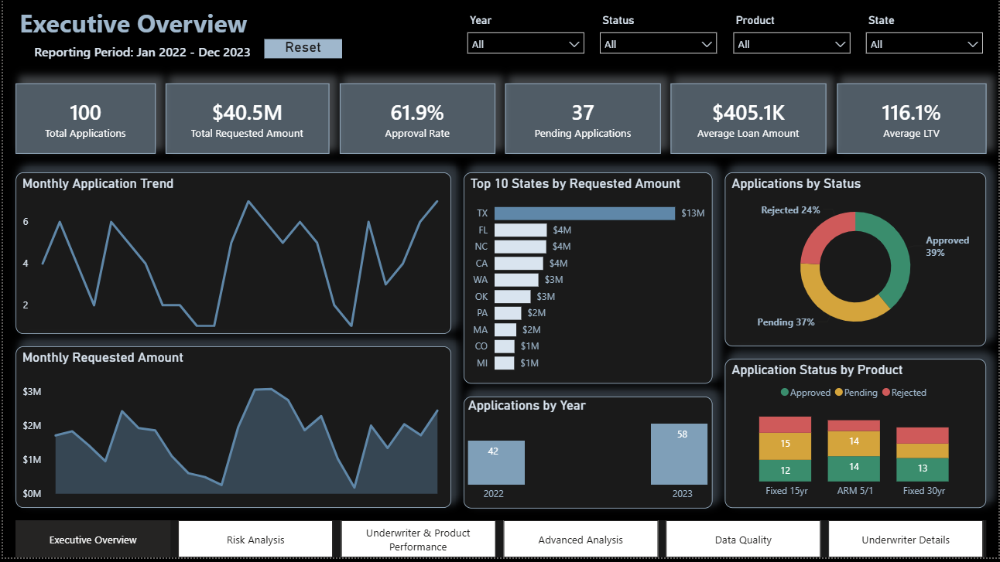
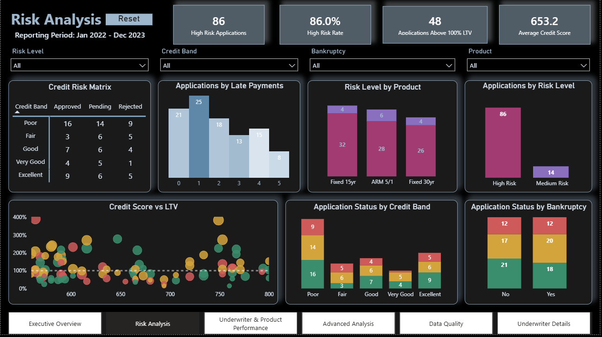
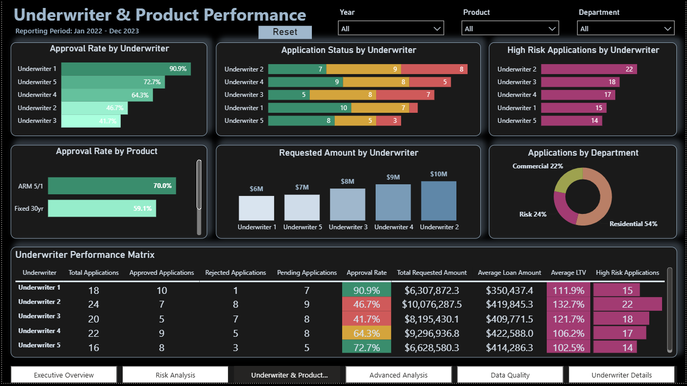
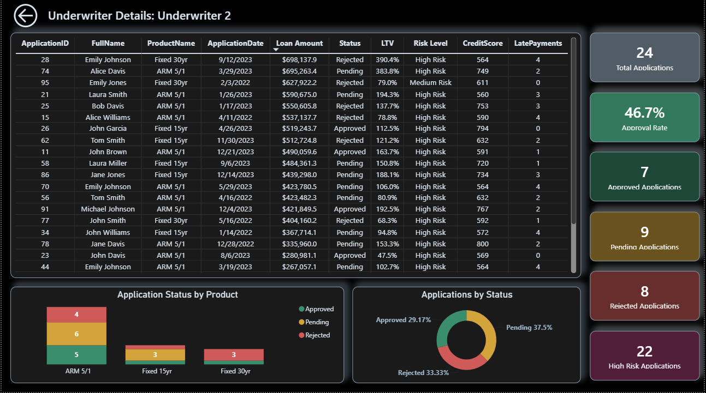
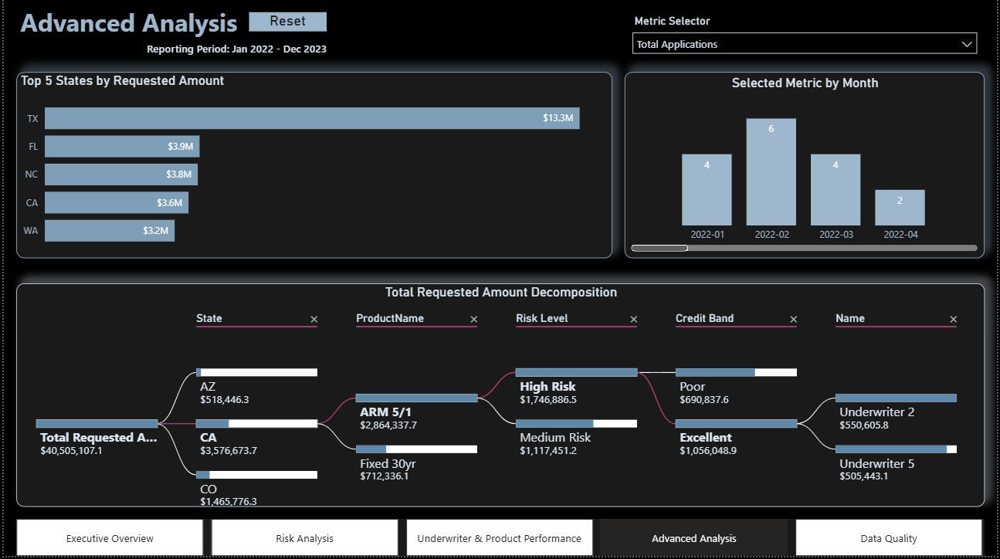
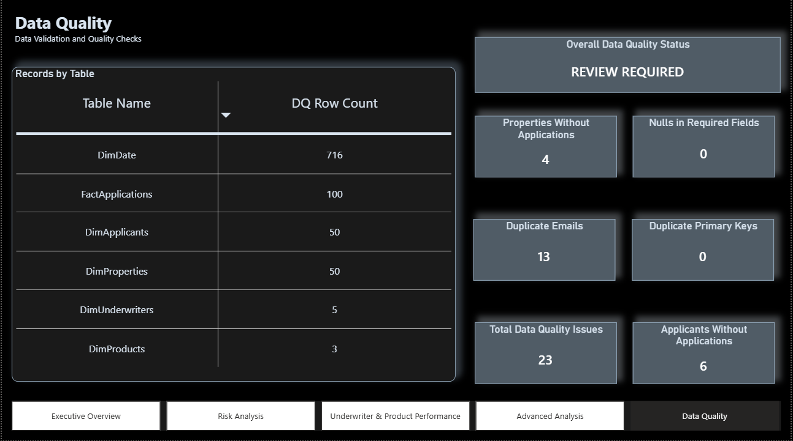
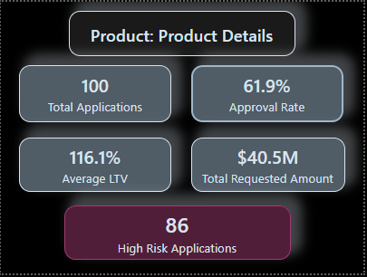

# Loan Application Risk and Underwriter Performance Analysis

## Overview

In this project, I built a Power BI report to analyze loan applications from both portfolio and operational perspectives. The workflow covered data preparation, dimensional modeling, DAX calculations, rule-based risk segmentation, portfolio monitoring, underwriter performance evaluation, interactive navigation, and data quality validation.

The report combines high-level portfolio indicators with drillthrough analysis, dynamic metric selection, decomposition analysis, and application-level detail. It was developed as part of a Power BI workshop assignment.

---

## Project Objectives

The main objectives of the project were to:

- prepare and clean the source tables in Power Query;
- build a star-schema data model around the loan application fact table;
- create a dedicated date dimension for time-based analysis;
- calculate loan-to-value, credit, and risk classifications;
- define reusable DAX measures for portfolio and performance analysis;
- design clear and consistent report pages;
- provide drillthrough, tooltip, navigation, and reset interactions;
- validate the quality and structural consistency of the data.

---

## Repository Structure

```text
loan-application-risk-analysis-power-bi/
│
├── Dashboard/
│   └── Loan_Application_Risk_Analysis.pbix
│
├── images/
│   ├── executive_overview.png
│   ├── risk_analysis.png
│   ├── underwriter_product_performance.png
│   ├── underwriter_details.png
│   ├── advanced_analysis.png
│   ├── data_quality.png
│   └── product_tooltip.png
│
└── README.md
```

> Place the final Power BI file in the `Dashboard` folder using the name shown above. Raw source files are not included in this repository.

The repository contains the final report file and dashboard screenshots. The source dataset is intentionally excluded from the public repository.

---

## Data Model

The model follows a star-schema structure with `FactApplications` as the central fact table.

The main dimension tables are:

- `DimApplicants`
- `DimProperties`
- `DimProducts`
- `DimUnderwriters`
- `DimDate`

The relationships are one-to-many, with single-direction filtering from the dimension tables to the fact table.

The date table includes Date, Year, Quarter, Month, Month Number, Year-Month, and Year-Month Sort fields.

---

## Data Preparation

The preparation process was completed in Power Query and included:

- reviewing and correcting column data types;
- formatting identifiers as whole numbers;
- assigning appropriate data types in Power Query and applying model-level formats for dates, currency values, ZIP codes, and percentages;
- trimming and cleaning text fields;
- standardizing applicant names and email values;
- creating a full-name field;
- merging applicant and credit-history data;
- retaining the credit score, bankruptcy, and late-payment attributes required for analysis;
- checking record counts before and after transformations;
- reviewing null values and repeated email addresses.

---

## Calculated Columns and Risk Logic

The model includes calculated columns for:

- Loan-to-Value Ratio
- LTV Band
- Credit Band
- Risk Level

Credit scores are classified as Poor, Fair, Good, Very Good, or Excellent.

Risk classification is based on a combination of credit score, bankruptcy history, late payments, and loan-to-value ratio.

> The risk categories are analytical rules defined for this project. They should not be interpreted as a production credit-scoring or lending-decision model.

---

## Core Measures

A dedicated measure table organizes the analytical measures used throughout the report, including:

- total applications;
- unique applicants;
- total requested amount;
- average loan amount;
- approved, rejected, and pending applications;
- decided applications;
- approval, rejection, and pending rates;
- approved and rejected loan amounts;
- average LTV;
- high-risk applications and high-risk rate;
- applications above 100% LTV;
- applications per applicant;
- average credit score.

---

## Dashboard Pages

### 1. Executive Overview

The executive page provides a concise summary of the loan portfolio, including total applications, requested amount, approval rate, pending applications, average loan amount, average LTV, monthly trends, state-level requested amounts, application status, product status, and annual application volume.



### 2. Risk Analysis

This page focuses on credit and collateral risk. It includes a credit-risk matrix, late-payment analysis, product risk, risk-level distribution, credit score versus LTV analysis, status by credit band, and status by bankruptcy history.



### 3. Underwriter and Product Performance

This page compares underwriters, products, and departments. It includes approval rate, application status, high-risk volume, requested amount, product approval rate, department distribution, and a detailed underwriter performance matrix.



### 4. Underwriter Details

This hidden drillthrough page provides record-level detail for the selected underwriter. It includes KPI cards, product and status visuals, a detailed application table, and a back button. Users reach the page from underwriter-based visuals rather than through the main navigation menu.



### 5. Advanced Analysis

This page includes a field parameter for switching the monthly metric, a Top 5 states analysis, a decomposition tree, a reset button, and page navigation.



### 6. Data Quality

The data quality page summarizes record counts and validation checks for null values, duplicate primary keys, repeated email records, applicants without applications, properties without applications, total issues, and overall quality status.

The current checks identify 23 items requiring review: 13 repeated email records, 6 applicants without applications, and 4 properties without applications. No required-field nulls or duplicate primary keys were detected.



---

## Interactive Features

The report includes:

- page navigation;
- slicers for year, status, product, state, department, risk level, credit band, and bankruptcy status;
- reset-filter buttons built with bookmarks;
- drillthrough from underwriter visuals to the detail page;
- a custom report-page tooltip for product-level metrics;
- Top N filtering;
- field parameters;
- a decomposition tree;
- conditional formatting.

### Product Tooltip

The custom tooltip displays product-specific values for total applications, approval rate, average LTV, total requested amount, and high-risk applications.



---

## Key Findings

The current report indicates that:

- the portfolio contains 100 loan applications;
- the total requested amount is approximately $40.5 million;
- 39 applications were approved, 37 remained pending, and 24 were rejected;
- the approval rate among decided applications is 61.9%;
- the average requested loan amount is approximately $405.1 thousand;
- the average LTV is 116.1%;
- 86 applications are classified as high risk;
- Underwriter 1 has the highest approval rate at 90.9%;
- Underwriter 2 handles the largest requested amount and the highest number of high-risk applications;
- ARM 5/1 has the highest product approval rate at 70.0%;
- Texas represents the largest requested amount among the states in the dataset.

---

## Design Approach

The report uses a dark visual theme with restrained accent colors.

Application status colors are consistent across all pages:

- Approved: green
- Pending: amber
- Rejected: red

Risk categories use a separate purple palette so that risk and application status remain visually distinct.

---

## Tools and Technologies

- Microsoft Power BI Desktop
- Power Query
- DAX
- Star-schema data modeling
- Interactive report design
- Data quality validation

---

## How to Use the Report

1. Download the `.pbix` file from the `Dashboard` folder.
2. Open it in Power BI Desktop.
3. Use the slicers to filter the report.
4. Use the navigation menu to move between pages.
5. Use drillthrough on underwriter visuals to open the detail page.
6. Hover over product visuals to view the custom tooltip.
7. Use the field parameter on the Advanced Analysis page to switch the monthly metric.
8. Use the reset buttons to restore the default filter state.

---

## Author

**Mahsa Kazempour**  
Data Analyst
